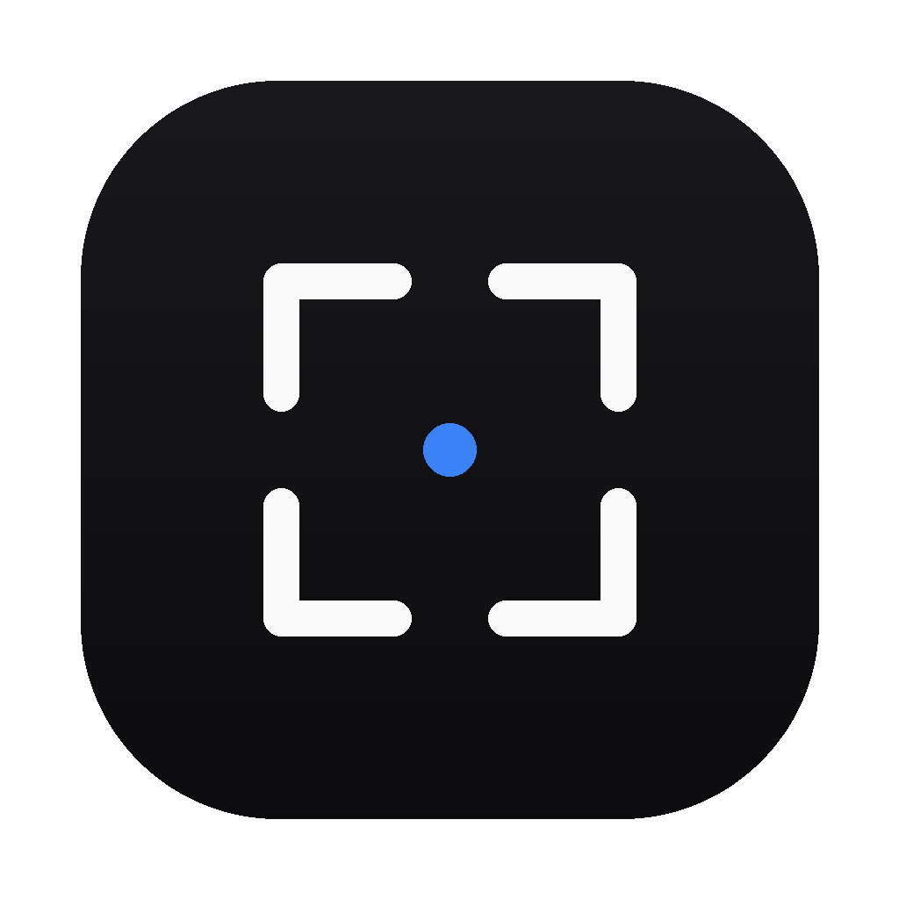
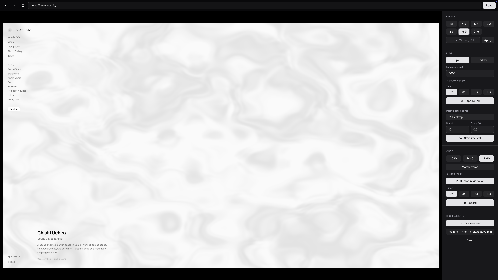

<div align="center">
  
  <h1>IOCapture</h1>
  <p>Webページ・インタラクティブコンテンツを、操作しながら比率・解像度を制御して綺麗にスクリーンショット／録画するデスクトップアプリ。</p>
</div>

---

IOCapture は、ブラウザで表示できるあらゆる Web コンテンツ — Webサイト、インタラクティブ作品、ジェネラティブ／WebGL（three.js / p5.js など）、ダッシュボード、デモ — を読み込み、**実際に操作しながら**、比率・解像度をコントロールして**静止画（スクリーンショット）／動画でキャプチャ**するための macOS 向けツールです。サイトの記録・ポートフォリオ・SNS・資料・印刷など、幅広い用途を想定しています。

<div align="center">
  
</div>

## 特長

- **URLを読み込んで操作** — 入力したWebページを自分のChromiumとして読み込み、スクロール・クリック・マウス操作ができる（インタラクティブコンテンツもそのまま動かせる）。
- **枠＝撮影範囲** — 目標比率のビューポートでページを表示し、見えている枠がそのまま出力になる（プレビューと出力がズレない）。
- **静止画（PNG スクリーンショット）** — 撮る瞬間だけ高DPR化して `capturePage` で取得。長辺px指定／**cm + dpi の実寸**指定に対応。アルファ（透過）対応。
- **動画（MP4 / H.264）** — ページのフレームを直接取得して録画（OSカーソルは入らず、枠ピッタリ、解像度自由）。システム音声のループバック録音に対応。CRF18の高画質。
- **比率** — 1:1 / 4:5 / 16:9 / 9:16 などのプリセット＋任意W:H。
- **インターバル連続撮影** — 指定間隔・枚数でフォルダへ自動連番保存。
- **要素の非表示** — CSSセレクタ指定、または**クリックで要素を選んで**消す（プレビュー＝撮影に反映）。
- **カーソル** — 動画にカーソルを入れる/入れないを切替（入れる場合は矢印を合成）。
- **セルフタイマー／カウントダウン** — 静止画・動画とも。
- **ナビゲーション** — 戻る／進む／リロード（⌘[ / ⌘] / ⌘R）。
- **状態の記憶** — URL・ウィンドウサイズ・比率・解像度・各種設定を保存。

## インストール

[Releases](https://github.com/io-studio-jp/IOCapture/releases) から最新の `.dmg`（Apple Silicon / arm64）をダウンロードし、`IOCapture.app` をアプリケーションへ。

> **未署名アプリについて**：現状コード署名・公証をしていないため、初回起動時に Gatekeeper が警告します。**右クリック →「開く」**、または システム設定 → プライバシーとセキュリティ →「このまま開く」で起動してください。

### 権限（macOS）

動画の**システム音声**録音には「画面収録」権限が必要です。初回録画時のプロンプト、または システム設定 → プライバシーとセキュリティ → **画面収録** に IOCapture を追加してオンにし、アプリを再起動してください。（映像のみの録画に権限は不要です。）

## 使い方

1. 上部のバーにWebページのURLを入れて **Load**（`https://` は省略可）。
2. 右パネルで **比率** と **解像度** を選ぶ。
3. **Capture Still** で静止画（保存先を選択）。**Record** で動画（停止すると保存）。
4. 必要に応じて **Interval**（連続撮影）、**Hide elements**（不要UIを消す）、**Timer**（タイマー）を使う。

## 開発（ソースからビルド）

```bash
npm install
npm run dev        # 開発起動
npm test           # 純粋ロジックのユニットテスト
npm run build      # 型チェック＋ビルド
npm run build:mac  # macOS の .app / .dmg を生成（dist/）
```

## 技術構成

Electron / electron-vite / React / TypeScript / Tailwind CSS / shadcn/ui / ffmpeg-static。
作品ビューは `WebContentsView` をシェルUIの上に重ねて配置。動画は `beginFrameSubscription` のフレームを ffmpeg にraw供給して生成し、音声は別録りして合成します。

## 既知の制約

- 現状 **Apple Silicon (arm64) の未署名ビルド**を配布。
- WebGL/canvas を使うコンテンツでは、静止画の解像感がページ側の `pixelRatio` 上限に依存することがあります（自作なら上限を上げるとより高精細に）。
- 巨大解像度はGPUのテクスチャ上限（約16384px）で頭打ち（超過時は自動で上限へ縮小）。

## ライセンス

[MIT](LICENSE) © I/O STUDIO / Chiaki Uehira
